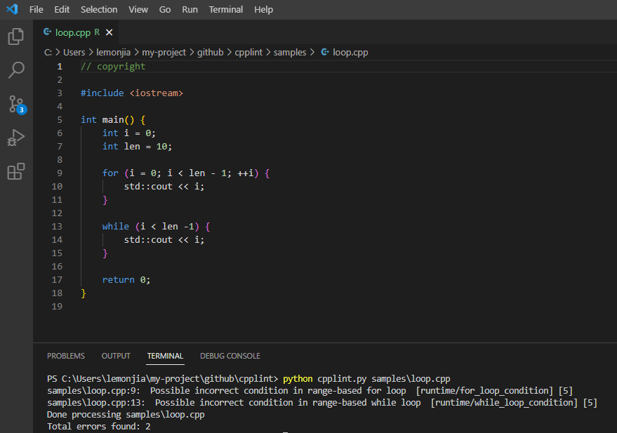

# cpplint

[](https://github.com/devops-lintflow/cpplint/tags)


## Introduction

*cpplint* is a static code checker for C++, forked from https://github.com/cpplint/cpplint


## Features




## Prerequisites

- Python >= 3.7.0


## Run

```bash
python3 cpplint.py sample/loop.cpp
```


## Usage

```
Syntax: cpplint.py [--verbose=#] [--output=emacs|eclipse|vs7|junit|sed|gsed]
                   [--filter=-x,+y,...]
                   [--counting=total|toplevel|detailed] [--root=subdir]
                   [--repository=path]
                   [--linelength=digits] [--headers=x,y,...]
                   [--recursive]
                   [--exclude=path]
                   [--extensions=hpp,cpp,...]
                   [--includeorder=default|standardcfirst]
                   [--quiet]
                   [--version]
        <file> [file] ...
```


## License

Project License can be found [here](LICENSE).


## Reference
